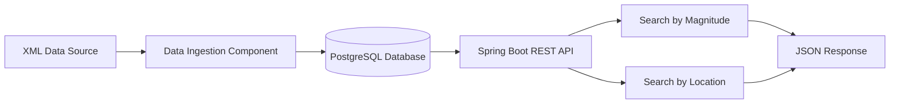

# Building a Star Catalog Search System Using AI Assistance

## Overview

In this lab exercise, you will build a complete data processing and search system for astronomical data using AI code assistants. Instead of writing code manually, you'll learn how to effectively communicate your requirements to AI tools and validate their output.

The system consists of two main components:
1. A data ingestion component that processes XML-based star catalog data
2. A RESTful API that enables searching through the processed data

## Learning Objectives

By the end of this lab, you will be able to:
- Break down complex requirements into AI-friendly prompts
- Effectively communicate technical requirements to AI assistants
- Validate and test AI-generated code
- Iterate and refine AI-generated solutions
- Understand the structure of Spring Boot applications through AI assistance

## Prerequisites

- Access to an AI code assistant (e.g., GitHub Copilot, Cursor)
- Java Development Kit (JDK) 17 or later
- Maven or Gradle
- Your preferred IDE (IntelliJ IDEA recommended)
- PostgreSQL database

## System Architecture



## Working with AI Assistants

### Best Practices

1. **Clear Context Setting**
   - Begin by explaining the overall project
   - Provide relevant technical constraints
   - Share sample data structures

2. **Incremental Development**
   - Break down the project into smaller tasks
   - Get AI to generate one component at a time
   - Validate each component before moving to the next

3. **Iterative Refinement**
   - Start with basic functionality
   - Gradually add complexity
   - Use AI to refactor and optimize

4. **Validation and Testing**
   - Ask AI to generate test cases
   - Use AI to explain the generated code
   - Have AI suggest potential edge cases

## Data

The data for this lab is available from here:

https://we.tl/t-rFVE7gcTzG

A subset of the data is also available in the `data` directory of this repository.


## Lab Tasks

### Task 1: Project Setup

There are two approaches to setting up the project.

1. Use Spring Initializr to create the project, download the zip file and open it in your IDE. You can ask the AI to help you with this.
2. Use AI to generate the project structure.

I would probably suggest starting with option 1 and then using the AI to help you set up the project structure.

```
I need to create a Spring Boot application for processing astronomical data.
The application needs to:
- Use Spring Boot 3.x
- Include dependencies for XML processing, JPA, and PostgreSQL
- Have a basic project structure for a data ingestion service and REST API
Can you help me use Spring Initializr to create the project?
```

### Task 2: Data Model Creation

Share the sample VOTable XML with the AI and ask for help creating the data model. Example prompt:

```
I have a VOTable XML format containing star data. Here's a sample of the data structure:
[paste relevant XML snippet]

I need to create a JPA entity class that:
- Captures the essential star properties (ID, coordinates, magnitude)
- Uses appropriate data types and annotations
- Includes proper indexing for search operations

Can you help me design this entity class?
```

### Task 3: XML Parser Implementation

Break down the XML parsing task for the AI. Example prompt:

```
I need to parse VOTable XML format astronomical data.
Key requirements:
- Handle large XML files efficiently
- Extract specific fields (PICid, coordinates, magnitude)
- Convert parsed data into Star entities
- Include error handling for malformed XML

Can you help me create a service class for this parsing?
```

### Task 4: Search API Development

Guide the AI in creating the search functionality. Example prompt:

```
I need to implement two types of star searches:
1. By magnitude range (min to max)
2. By location (using RA, Dec, and radius in degrees)

Requirements:
- RESTful endpoints
- Proper input validation
- Efficient database queries
- Appropriate error handling

Can you help me create:
1. The controller class with endpoints
2. The service layer with search logic
3. The repository interface with necessary queries
```

## Implementation Strategy

1. **Initial Setup (30 minutes)**
   - Use AI to generate project structure
   - Review and understand generated setup
   - Verify all necessary dependencies

2. **Data Model (45 minutes)**
   - Share data sample with AI
   - Iterate on entity design
   - Add validation and indexes

3. **Data Ingestion (1 hour)**
   - Develop parser with AI assistance
   - Test with sample data
   - Handle edge cases

4. **Search API (1 hour)**
   - Implement basic endpoints
   - Add search logic
   - Optimize queries

5. **Testing and Refinement (45 minutes)**
   - Generate test cases
   - Verify functionality
   - Performance optimization

## Common Challenges and AI Prompts

### 1. Handling Large XML Files

```
The XML parser needs to handle files over 1GB.
How can we:
- Use streaming parsing
- Implement batch processing
- Manage memory efficiently
Can you show me the best approach?
```

### 2. Optimizing Location Search

```
The location search using RA/Dec needs to be efficient.
Requirements:
- Handle coordinate system calculations
- Optimize for large datasets
- Consider using spatial indexes
How should we implement this?
```

### 3. Error Handling

```
I need comprehensive error handling for:
- XML parsing issues
- Invalid search parameters
- Database connection problems
Can you help me implement a global error handling strategy?
```

## Validation Steps

After each AI-generated component:

1. **Code Review**
   - Does it follow best practices?
   - Is it properly documented?
   - Are there potential security issues?

2. **Testing**
   - Does it handle edge cases?
   - Is error handling comprehensive?
   - Is performance acceptable?

3. **Integration**
   - Does it work with other components?
   - Are interfaces consistent?
   - Is the API contract maintained?

## Submission Requirements

1. Complete source code (AI-generated with your refinements)
2. Documentation of:
   - AI prompts used
   - Modifications made to AI-generated code
   - Challenges encountered and solutions
3. Test results and performance metrics
4. Reflection on the AI-assisted development process

## Evaluation Criteria

- Effective use of AI assistance
- Quality of implemented solution
- Documentation of AI interaction
- Testing and validation approach
- Problem-solving methodology
- Final system performance

## Tips for Success

1. **Be Specific in Prompts**
   - Include technical requirements
   - Specify frameworks and versions
   - Provide context and constraints

2. **Iterate and Refine**
   - Start with basic functionality
   - Gradually add complexity
   - Use AI to optimize code

3. **Validate Continuously**
   - Test each component
   - Verify integration points
   - Check edge cases

4. **Document the Process**
   - Keep track of successful prompts
   - Note any AI limitations
   - Record optimization steps 